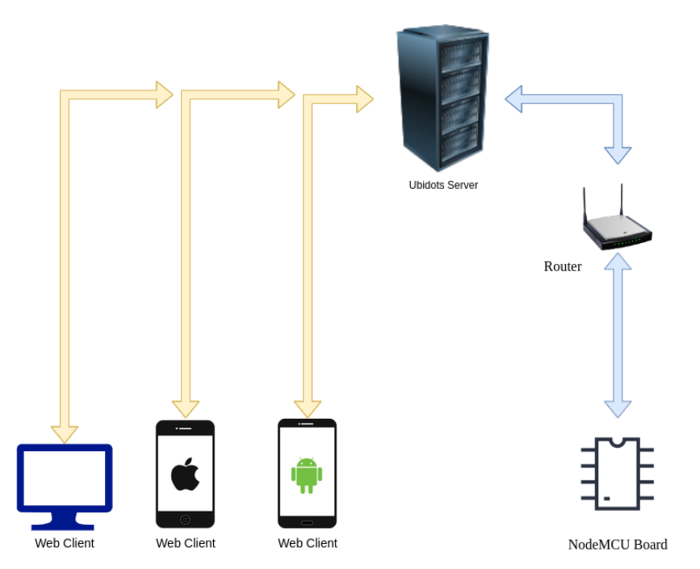
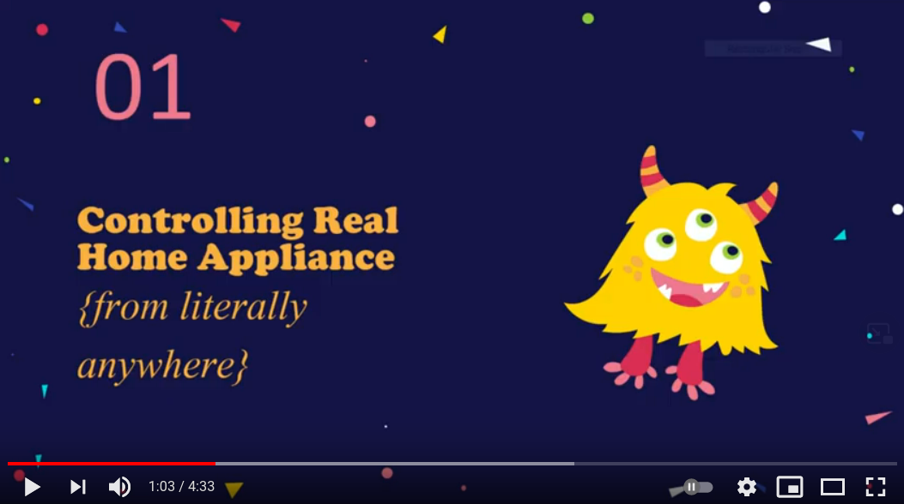

# Home Automation

This project demonstrates an approach to control Real home appliances via external website. Detailed information is given in the [project report](CS226%20Project%20Report.pdf)

## Architecture

### Demonstration

#### Related other projects & Final thoughts

As a part of this project, I have slightly modified a library and extended it's functionality, i.e., **Mail sending** feature.

[**ubidots-mqtt-esp**](https://github.com/CITIZENDOT/ubidots-mqtt-esp/)

Take a look at the [source code](CS226_Lab.ino), which is loaded into NodeMCU board.
